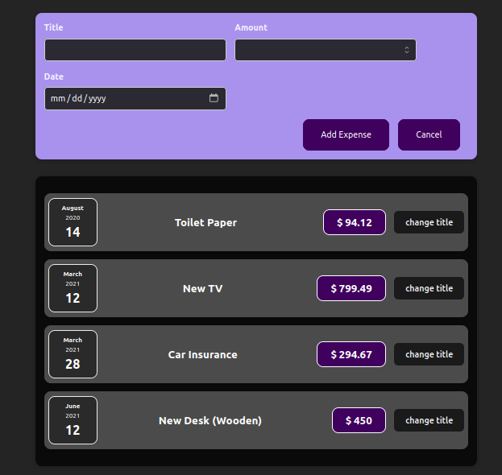

# Expense Tracker App

This is a simple expense tracker app built with React and TypeScript.

## Description

The Expense Tracker App allows users to keep track of their expenses by adding new expenses and seeing their total expenses for a certain period of time.

## Features

- Add new expenses **(not implemented yet)**
- Filter expenses by year **(not implemented yet)**
- Chart visualization of expenses by month **(static)**

## Technologies Used

- React
- TypeScript
- CSS

## What I Learned

During the development of this project, I learned:

* React Core Syntax & JSX
* Working with Components.
* Working with Data and share it with `Props`.
* How to build a React app using TypeScript
* How to create reusable components with props and interfaces
* How to style a React app with CSS
* How to use React hooks to manage state and handle user input.
* How to use charting libraries like Chart.js to visualize data **(Not Yet)**.

## Getting Started

1. Clone the repository: `git clone https://github.com/Abdalrhman7mida/expense-tracker.git`
2. Install dependencies: `npm install`
3. Run the app: `npm start`

## Screenshots

## Credits

This app was created by [Abdalrhman Hemida](https://github.com/Abdalrhman7mida). 

## License

This project is licensed under the MIT License. See the [LICENSE](./LICENSE)